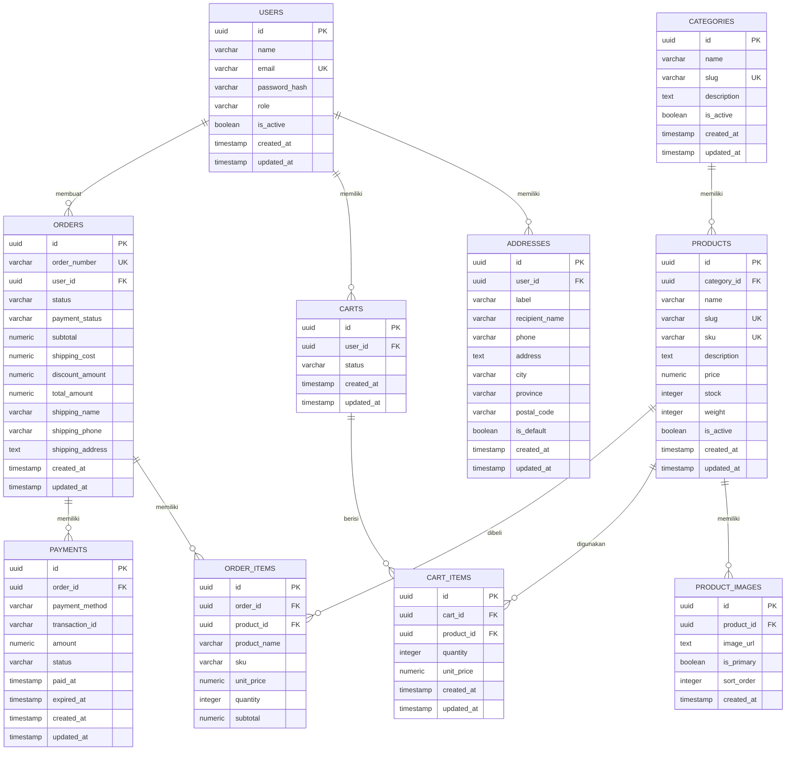

# ERD Ecommerce Single Vendor

## 1. Daftar Entitas

Aplikasi menggunakan entitas berikut:

- users
- categories
- products
- product_images
- carts
- cart_items
- orders
- order_items
- payments
- addresses

---

## 2. Relasi Antar Entitas

- Satu user dapat memiliki banyak alamat.
- Satu user dapat memiliki banyak keranjang.
- Satu user dapat membuat banyak pesanan.
- Satu kategori dapat memiliki banyak produk.
- Satu produk dapat memiliki banyak gambar.
- Satu keranjang dapat memiliki banyak item.
- Satu produk dapat berada di banyak item keranjang.
- Satu pesanan dapat memiliki banyak item.
- Satu produk dapat berada di banyak item pesanan.
- Satu pesanan dapat memiliki satu atau beberapa pembayaran.

---

## 3. ERD Diagram

